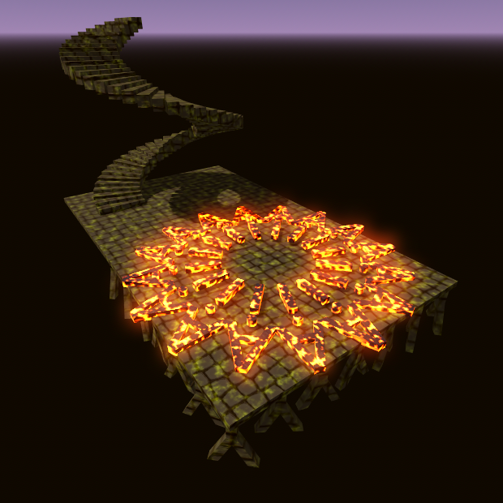
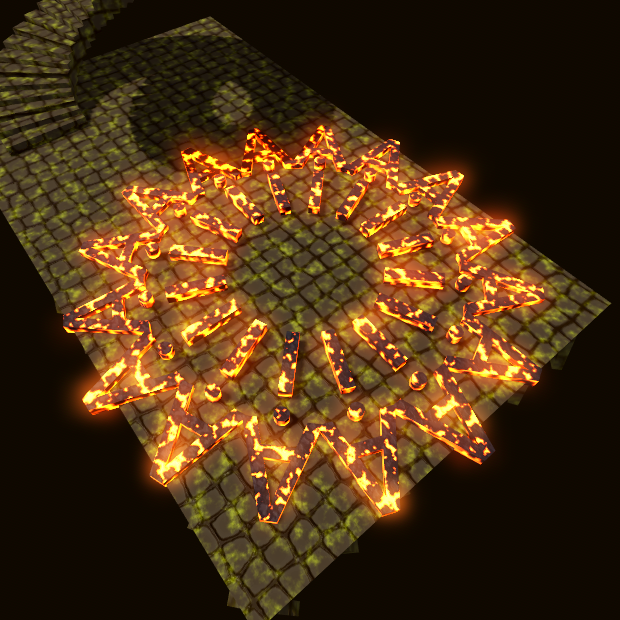
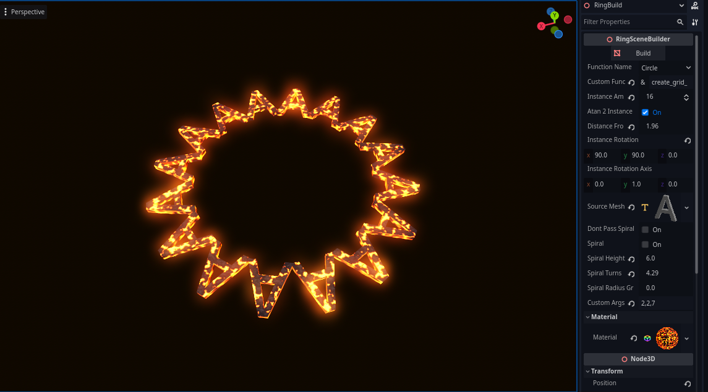
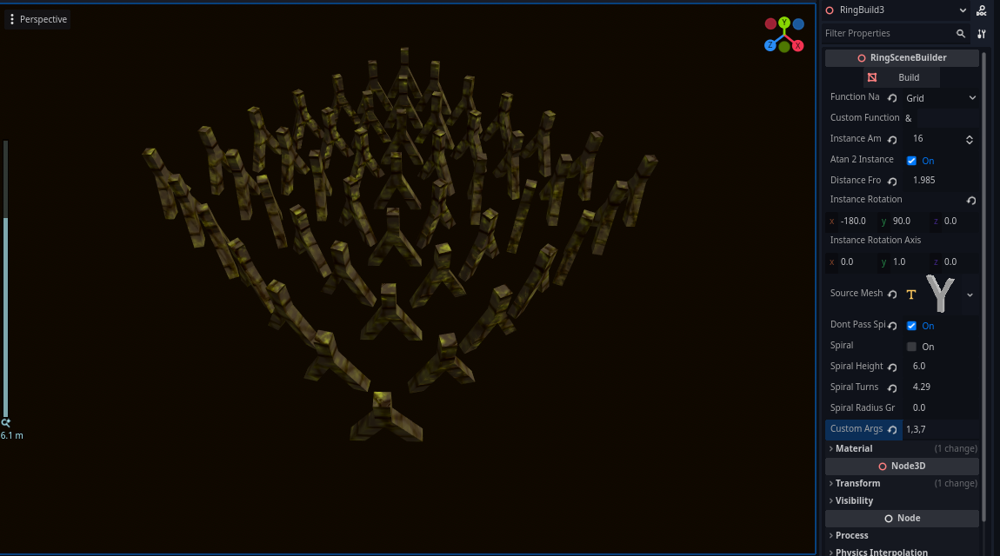

# Godot SceneBuilder

**A powerful, tool-based mesh scattering and merging addon for Godot 4.**


SceneBuilder allows you to procedurally scatter meshes in various patterns (Circle, Grid, or Custom) and automatically merges them into a single `MeshInstance3D` for optimized rendering. Based on **[MergingMeshes](https://github.com/EmberNoGlow/Merging-Meshes-Godot)**.

| | |
| --- | --- |
|  |  |
|  |  |


## 🌟 Features

*   **Procedural Scattering:** Easily arrange meshes in Circles or Grids.
*   **Spiral Support:** Create spiral staircases or DNA-like structures with built-in spiral parameters (Height, Turns, Radius Growth).
*   **Mesh Merging:** Automatically combines all scattered instances into a single `ArrayMesh` using `SurfaceTool` to reduce draw calls - **HUGE PERFORMANCE GROWTH**.
*   **Editor Integration:** Runs entirely within the Godot Editor (`@tool`).
*   **Smart Rotation:** Option to align instances using `atan2` (facing the center/tangent) or use fixed rotation axes.
*   **Extensible:** Write your own custom scatter algorithms in GDScript and pass arguments directly from the Inspector.

## 📦 Installation

1.  Download the repository.
2.  Copy the `addons/scenebuilder` folder into your project's `res://` directory.
3.  Go to **Project > Project Settings > Plugins**.
4.  Enable **SceneBuilder**.

## 🚀 Usage

1.  Add a **SceneBuild** node to your scene.
2.  In the Inspector, assign a mesh to the **Source Mesh** property.
3.  Select a **Function Name** (e.g., `Circle` or `Grid`).
4.  Adjust parameters like **Instance Amount** and **Distance From Center**.
5.  Click the **Build** button at the top of the Inspector properties to generate the mesh.

## ⚙️ Configuration

### General Settings
*   **Build Button:** Triggers the generation process.
*   **Function Name:**
    *   `Circle`: Scatters points in a ring or spiral.
    *   `Grid`: Scatters points in a square grid.
    *   `Custom`: Uses a user-defined function from `ScatterFunctions.gd`.
*   **Source Mesh:** The mesh resource to be scattered.
*   **Material:** Apply a material override to the generated result.

### Transform & Rotation
*   **Instance Amount:** The total number of meshes to generate.
*   **Distance From Center:**
    *   For `Circle`: The radius.
    *   For `Grid`: The half-extents of the grid area.
*   **Instance Rotation:** Offset rotation applied to every instance.
*   **Instance Rotation Axis:** The axis used for calculating alignment.
*   **Atan2 Instance Rotation:** If enabled, meshes will rotate based on their position (useful for making objects face the center or follow the curve).

### Spiral Settings (Circle Mode)
*   **Spiral:** Enable spiral distribution.
*   **Spiral Height:** Total vertical height of the spiral.
*   **Spiral Turns:** How many full rotations the spiral makes.
*   **Spiral Radius Growth:** Increases the radius as the spiral climbs (creates a funnel shape).

## 📝 Custom Functions

You can extend SceneBuilder with your own math without modifying the core logic.

### 1. Define the Function
Open `res://addons/scenebuilder/Scripts/ScatterFunctions.gd` and add a static function. It must accept specific standard arguments, followed by `...args`.

```gdscript
static func my_custom_shape(
    amount: int, 
    distance_to_center: float, 
    # Spiral args are passed by default unless 'DontPassSpiralArgs' is checked
    Spiral = false, SpiralHeight = 1.0, SpiralTurns = 1.0, SpiralRadiusGrowth = 0.0, 
    # Your custom arguments come last
    ...args 
) -> Array:
    var points = []
    # ... logic to append Vector3 positions to points ...
    return points
```

### 2. Configure in Editor
1.  Set **Function Name** to `Custom`.
2.  Set **Custom Function Name** to the name of your function (e.g., `my_custom_shape`).
3.  (Optional) Check **Dont Pass Spiral Args** if your function doesn't need spiral data.

### 3. Pass Custom Arguments
Use the **Custom Args** text field to pass data to your function. Supports Floats, Booleans, and Strings.

**Example Input:**
```text
true, 5.5, "hello"
```

**Accessing in Code:**
```gdscript
# Inside your function, args is an array:
var use_offset = args[0] # true
var offset_val = args[1] # 5.5
```

## 📐 Grid Mode Details

When using `Grid` mode, the standard parameters behave as follows:
*   **Distance From Center:** Acts as the Half-Width/Half-Depth of the grid.
*   **Custom Args:** You can pass `GridSizeX`, `GridSizeZ`, and `GridSegments` manually if needed, though the default logic calculates segments based on the square root of `InstanceAmount`.

## 📄 License

MIT License. Learn more in the **[LICENSE](LICENSE)**.

## Support

If you like the project, give it a star ⭐ - it makes it easier for others to find it!. Visit my [github profile](https://github.com/EmberNoGlow) to find more addons for Godot and beyond!

Also follow me on **[bsky](https://bsky.app/profile/embernoglow.bsky.social) | [dev.to](https://dev.to/embernoglow)**.
